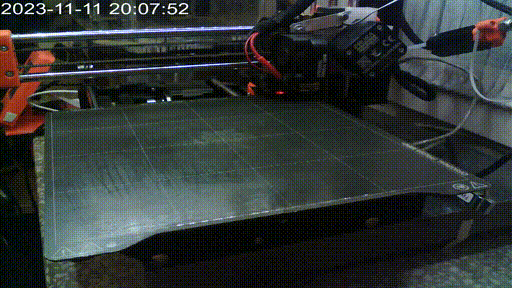

<table>
<tr>
<td valign="top" width="40%">

# About me

Hi, I'm Michał, or in just call me Mike.
How to reach me, don't expect a reply though:

* kaszpir at google.com - preferred communication channel
* Slack: `_KaszpiR_` @ kubernetes on `#pl-users` channel, [link](https://kubernetes.slack.com/archives/C4W6MFCEB)
* Discord - [Quake.World](http://discord.quake.world/) nick: `_KaszpiR_`
  but make sure to highlight me or message me directly
* [LinkedIn](https://www.linkedin.com/in/%F0%9F%90%BB-micha%C5%82-socho%C5%84-46724233/)

Not used that much:

* IRC - LiberaChat/OFTC/QuakeNet nick: `_KaszpiR_`
* twitter: [`_KaszpiR_`](https://twitter.com/_KaszpiR_)
  (yeah, I really never used that )

Below is what I do for a living:

* Consulting / support / development / implementation of network design
  & infrastructure and operations among various projects, often based on
  multiple public clouds such as AWS/GCP and on-premises.
* Cloud migrations with various scopes - from basic ‘lift and shift’,
  through replacing subset of services with cloud vendored solutions,
  up to full reimplementations from scratch.
* Redesigning systems when moving to the containers: analysis if the app is
  applicable to be containerized, creating container pipelines,
  creating packages for deployment (for example helm charts).
* Setting up full CI/CD stacks: application pipelines, infrastructure automation
  pipelines, mixed with monitoring and eye-candy graphs
  (management loves the colors and money in the same picture!).
* Cost estimation with capacity planning, automating dynamic resource
  allocations based on metrics.
* Pointy-haired Boss: - `Kubernetes`
  

# Currently interested in

* observability - Prometheus / Tracing etc
* various clouds - especially AWS / GCP
* Kubernetes and it's ecosystem - because we love tools that are not even in alpha
* improving system's resilience via chaos engineering, but fear not,
  devs and users are always better at that ;)
* scalability issues within ETL systems

# Hobbies

* some simple electronics and automation, for example
  * [esphome](https://esphome.io/index.html)
  * [Node-RED](https://nodered.org/)
  * [Home Assistant](https://www.home-assistant.io/)
  * and others
* 3D Printing (mainly related to filament based ones like Prusa Mini+)
* sometimes gibbing people with rocket launcher -
  I wish I were midairing people in endif [like this](https://www.youtube.com/watch?v=pv_KDPXw_3U).

# Presentations

* Java on Kubernetes: problems and fixes related to HBase/Hadoop
  * [video](https://www.youtube.com/watch?v=GcFlHmMJ1Qo)
  * [slides](https://nvtkaszpir.github.io/presentations-java-in-k8s-hbase-hdfs/#/)
  * 2020, in polish, how to put elephants into containers (in short REALLY do not)
* From zero to self-driving car using DonkeyCar
  * [video](https://www.youtube.com/watch?v=THUL0AWHe2w)
  * [slides](https://docs.google.com/presentation/d/1xLcbvkTPm6mrMvHxmm997VXiHFwlFll4WX8y2JT1xBc/edit)
  * 2020, in english, how to make a self-driving robot which allows to get
    to know with RasberryPi, automation, python coding and stuff related to
    ML/AI in general
* Configuration management hell
  * [video](https://www.youtube.com/watch?v=MoObKRodHnU)
  * 2019, in polish, and some rants especially about fallacies of immutable
    infrastructure
* With pickaxe into the cloud
  * [video](https://youtu.be/9Vhi6_iIWzI)
  * 2019, in polish, talk about using cloud and if cloud solves all your
    problems
* Why you suck at being a devops person
  * [slides](https://nvtkaszpir.github.io/presentations-wdi2018/)
  * [source](https://github.com/nvtkaszpir/presentations-wdi2018)
  * 2018, non-recorded presentation with catchy title about why I suck at being
    a devops person, I wish to review that and record it some day...
* Sphinx reST and Ansible
  * [video](https://www.youtube.com/watch?v=F60O_KkUsZg)
  * 2018, in polish, about restructured text,
    sphinx docs generator and how to generate docs from Ansible
* Infrastructure as Code
  * [video](https://www.youtube.com/watch?v=yCRUnXqiH_I)
  * 2017, in polish
* AWS Elastic Container service in practice
  * [video](https://www.youtube.com/watch?v=u5ahMYnJIYc)
  * 2016, in polish, notice that AWS ECS nowadays looks a bit different, though.

</td>
<td valign="top" width="60%">

# Repos

Of course a lot of code goes to other private repos owned by the clients,
unless things could go to upstream repos, so publicly available stuff on my
GitHub is usually related to hobbies. Some repos you may be interested in:

* [cs-mikrotik-bouncer-alt](https://github.com/nvtkaszpir/cs-mikrotik-bouncer-alt) - CrowdSec bouncer for MikroTik devices

  
  
* [quake-logo-wall-light](https://github.com/nvtkaszpir/quake-logo-wall-light) 90x70 cm with WLED

  

* [3d printer smart enclosure](https://github.com/nvtkaszpir/esphome-3d-printer-smart-enclosure) using esphome

  

* [esphome as Pomodoro](https://github.com/nvtkaszpir/esphome-pomodoro) esphome as Pomodoro

  

* [prusa-connect-camera-script](https://github.com/nvtkaszpir/prusa-connect-camera-script) - send image capture from various cameras to Prusa Connect
  
  
  * [see documentation](https://nvtkaszpir.github.io/prusa-connect-camera-script/)
  * Raspberry Pi CSI cameras (the ones with a ribbon)
  * USB cameras
  * esp32 camera still image / stream capture single frame and send
  * RSTP/RTMP/HLS stream capture single frame
  * optional image flips/rotations, timestamps etc

* [3d-print](https://github.com/nvtkaszpir/3d-print) - 3D Printers and stuff

  
* [prusa-esp32-node-red-time-lapse](https://github.com/nvtkaszpir/prusa-esp32-node-red-time-lapse) - use ESP32 and
  Node-RED to make a nice timelapse vids

  
* [config-prusa-prometheus-json-exporter](https://github.com/nvtkaszpir/config-prusa-prometheus-json-exporter) -
  gather metrics from the printer and store them in Prometheus

  
* [gcode2png](https://github.com/nvtkaszpir/gcode2png) - ugly render of gcode to image

  

Some old/dormant projects:

* [vagrant-gitlab-runners](https://github.com/nvtkaszpir/vagrant-gitlab-runners) -
  all you need is bash for GitLab runners in Vagrant
* [workstation](https://github.com/nvtkaszpir/workstation) -
  provisioning my rusted laptop, this happens so rarely (once 4y?) that this is
  probably more broken than working
* [rpi](https://github.com/nvtkaszpir/rpi) and [rpi-power-button](https://github.com/nvtkaszpir/rpi-power-button) -
  because ignorance causes history to repeat itself
* [docker + buildx](https://github.com/nvtkaszpir/docker-buildx-trash) -
  more like an inspiration for those interested in multi-arch containers
* [dh-chaos](https://github.com/nvtkaszpir/dh-chaos) - aka how to waste time
  waiting for Azure on hackaton while fiddling with chaos-toolkit
* [kind-minefield](https://github.com/nvtkaszpir/kind-minefield) -
  jenkins pipeline which shows how to prevent your friends from abusing
  resources on your precious computer, which you keep alive since 2010
  in the basement (the computer, not the friends...)
* [devops-sig-8](https://github.com/nvtkaszpir/devops-sig-8) - k8s and config
  management - how to manage live config updates in pods,
  see forked repo and its branches for more!
* [python-github-create-issue](https://github.com/nvtkaszpir/python-github-create-issue) -
  use python script to create issue from CLI,
  useful in certain CI systems (but I bet no one uses it),
  not really sure if this still works, though.

</td>
</tr>
</table>
